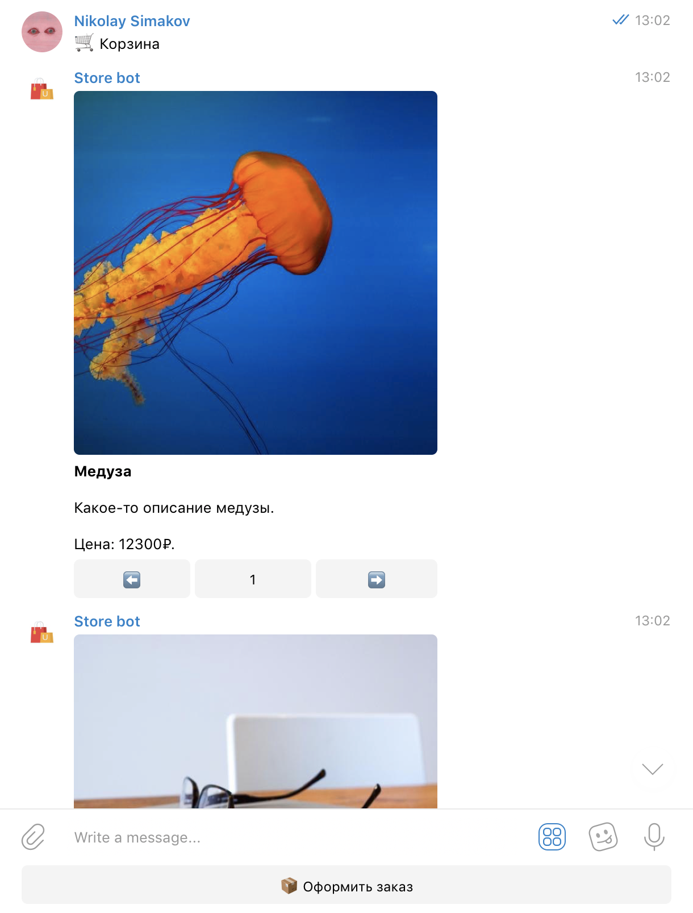
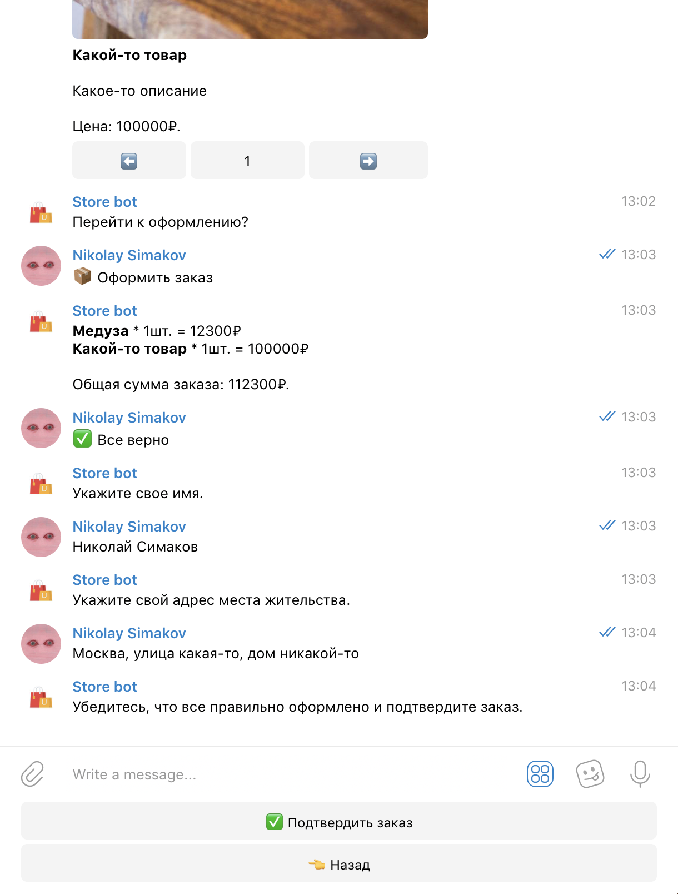
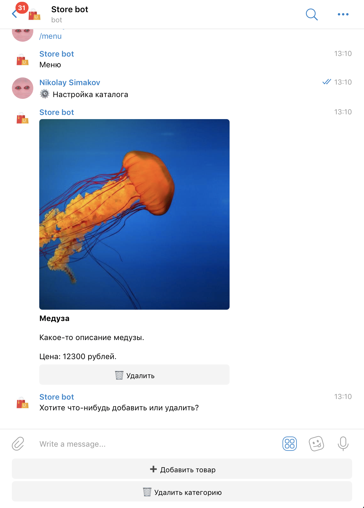
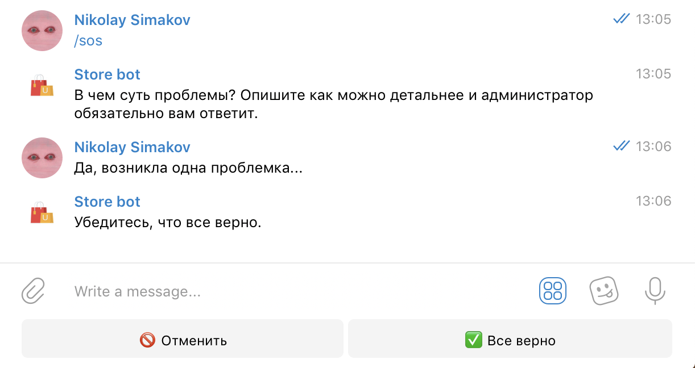

<p align="center">
  <a href="https://t.me/example_store_bot"></a>
</p>

This is an example Telegram shop bot. It's a simple and, most importantly, efficient way to place an order without leaving your favorite messenger.

## What can it do?

1. `/start` - needed to start the bot and choose the mode (user/admin).

2. `/menu` - go to the menu.

3. `/sos` - ask the administrator a question.

## Menu

The user menu looks like this:


## Catalog

The catalog consists of products sorted by categories. Users can add items to their cart, and the admin has full control over catalog management (addition/removal).

## Cart

The ordering process looks like this: the user goes to the `🛍️ Catalog`, selects the desired category, chooses products, and clicks the `🛒 Cart` button.



---

Then, after making sure everything is in place, proceed to checkout by clicking `📦 Place Order`.



## Add a Product

To add a product, select a category and click the `➕ Add Product` button. Then, fill out the "name-description-image-price" form and confirm.



## Contacting Administration

To ask the admin a question, simply select the `/sos` command. There is a limit on the number of questions.



## Get started

1. Clone this repository.

2. Create and activate virtual enviroment:

Windows:

```powershell
python -m venv venv
& venv/scripts/activate.ps1
```

UNIX:

```bash
python3 -m venv venv
source venv/scripts/activate
```

3. Install the requirements:

```bash
pip install -r requirements.txt
```

4. Create and populate `.env` file in the root directory. Here are the required keys (_\*_ - always required; _\*\*_ - required only in production):

| Key                                  | Value                                                                                                                                       |
| ------------------------------------ | ------------------------------------------------------------------------------------------------------------------------------------------- |
| BOT*TOKEN (*\*\_)                    | To get bot token, you need create a bot via [BotFather](https://t.me/BotFather/).                                                           |
| PROJECT*NAME (*\*\*\_)               | Name of your project on Heroku (required if you want to deploy bot on Heroku).                                                              |
| WEBHOOK*HOST, WEBHOOK_PATH (*\*\*\_) | Webhook host and path.                                                                                                                      |
| ADMINS (_\*\*_)                      | A comma-separated string of admins IDs (e.g., 000000000,123456789). To get your Telegram ID, use [Get My ID bot](https://t.me/getmyid_bot). |

Example:

```properties
BOT_TOKEN=YOUR_BOT_TOKEN
ADMINS=123456789,000000000
```

5. Run `app.py`:

```bash
python3 app.py
```
